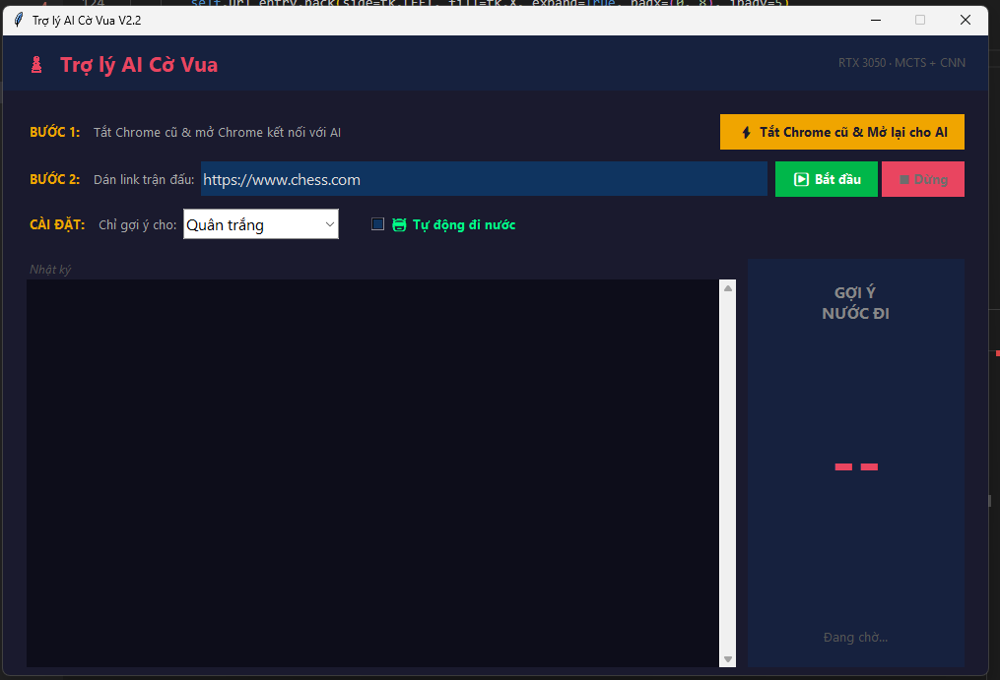

# AI Play Chess ♟️

Dự án AI chơi cờ vua kết hợp giữa các phương pháp lập trình cờ vua truyền thống (Minimax, Alpha-Beta Pruning, Bảng giá trị vị trí - PST) và các kỹ thuật Học sâu hiện đại (Neural Network, Monte Carlo Tree Search - MCTS). Đặc biệt, Bot có khả năng đọc trực tiếp trạng thái bàn cờ từ trang chess.com để hỗ trợ hoặc tự động chơi.


## 🌟 Tính năng nổi bật

- **Hybrid AI Engine:** Kết hợp Mạng Nơ-ron và MCTS để đánh giá chiến lược dài hạn, đồng thời dùng Minimax (Negamax) với Alpha-Beta Pruning để tính toán chính xác các chiến thuật (tactics) trong ngắn hạn.
- **Tối ưu hóa vị trí:** Sử dụng Bảng giá trị vị trí (Piece-Square Tables - PST) để thưởng/phạt cách bố trí quân cờ, giúp AI biết chiếm quyền kiểm soát trung tâm.
- **Học hỏi liên tục (Online Learning):** Có khả năng tự động học lại từ các ván đấu vừa kết thúc để cải thiện Trọng số (Weights) của Mạng Nơ-ron.
- **Tích hợp Chess.com:** Có thể phân tích DOM để trích xuất vị trí bàn cờ hiện tại từ web chess.com.
- **Giao diện thân thiện:** Tích hợp GUI trực quan bằng Python.

## 📁 Cấu trúc Dự án

```text
ai_play_chess/
├── bot.py                # Bộ não của AI: Kết hợp MCTS, Minimax, PST, Opening Book.
├── gui.py                # File khởi chạy chính (Entry point), giao diện người dùng.
├── train.py              # Script để huấn luyện model Neural Network độc lập.
├── chess_com_reader.py   # Script quét và đọc bàn cờ từ giao diện của chess.com.
├── engine/               # Chứa kiến trúc Deep Learning:
│   ├── model.py          # Định nghĩa Mạng Nơ-ron (ChessNet).
│   ├── mcts.py           # Thuật toán Monte Carlo Tree Search.
│   └── board_utils.py    # Các hàm hỗ trợ xử lý bàn cờ (Tensor conversion).
├── models/               # Nơi lưu trữ các file weights của model (VD: chess_model_it4.pth).
├── run_bot.bat           # Script khởi chạy nhanh Bot cùng GUI trên Windows.
└── training.bat          # Script khởi chạy quá trình huấn luyện mô hình.
```

## 🚀 Hướng dẫn Cài đặt & Sử dụng

### 1. Yêu cầu hệ thống
- Cài đặt sẵn **Python 3.8+** trên máy.
- *Khuyến nghị:* Máy có GPU (NVIDIA) và cài đặt PyTorch hỗ trợ CUDA để AI tính toán nhanh hơn.

### 2. Thiết lập Môi trường & Cài đặt Thư viện
Mở Terminal / Command Prompt tại thư mục dự án và chạy lần lượt các lệnh sau:

**Bước 1: Tạo môi trường ảo (Virtual Environment)**
```bash
python -m venv venv
```

**Bước 2: Kích hoạt môi trường ảo**
- Trên **Windows**:
```bash
venv\Scripts\activate
```
- Trên **macOS / Linux**:
```bash
source venv/bin/activate
```

**Bước 3: Cài đặt các thư viện cần thiết**
```bash
pip install -r requirements.txt
```

### 3. Khởi chạy Dự án

Để bắt đầu sử dụng Giao diện Trợ lý AI (GUI), hãy đảm bảo môi trường ảo đang được kích hoạt và chạy lệnh:
```bash
python gui.py
```

*(Mẹo cho Windows: Các lần sử dụng sau, bạn chỉ cần click đúp thẳng vào file `run_bot.bat` để phần mềm tự động bật).*

**Huấn luyện lại Model (Tùy chọn):**
Nếu bạn muốn huấn luyện AI học thêm từ các ván đấu, chạy file `training.bat` hoặc lệnh:
```bash
python train.py
```

## 🧠 Logic Hoạt động của AI (`bot.py`)

Khi yêu cầu AI tìm nước đi (`get_best_move`), Bot sẽ xử lý theo trình tự:
1. **Khai cuộc (Opening Book):** Kiểm tra xem thế cờ hiện tại có nằm trong Khai cuộc Ý (Italian Game) đã định nghĩa sẵn không.
2. **Chiến thuật (Tactics):** Tính toán sâu (nhìn trước nhiều nước đi) bằng thuật toán Minimax kết hợp Alpha-Beta Pruning nhằm phát hiện và đi các nước đi ăn quân, chiếu tướng hoặc thoát khỏi nguy hiểm khẩn cấp.
3. **Chiến lược (Strategy):** Dùng Neural Network để đánh giá thế cờ, MCTS để mở rộng nhánh tìm kiếm các nước đi khả thi, sau đó kết hợp với điểm số PST để chọn ra nước đi mang lại lợi thế cao nhất.
4. **Tránh đi lặp/đi lùi:** Tự động áp dụng các hình phạt với các nước đi lùi (undo) hoặc đi luẩn quẩn vô nghĩa.

---
*Dự án đang trong quá trình phát triển và hoàn thiện. Cảm ơn bạn đã quan tâm!*
